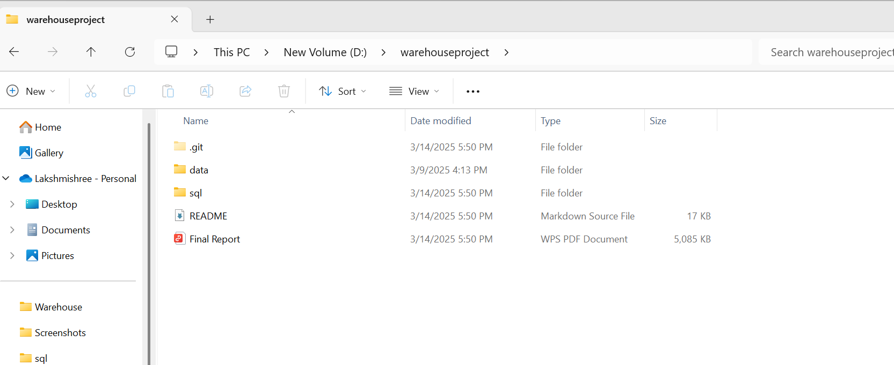
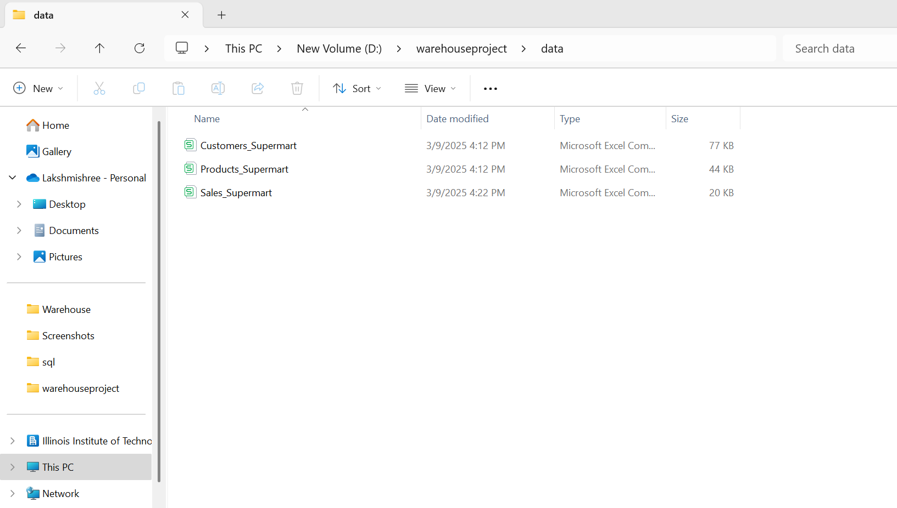
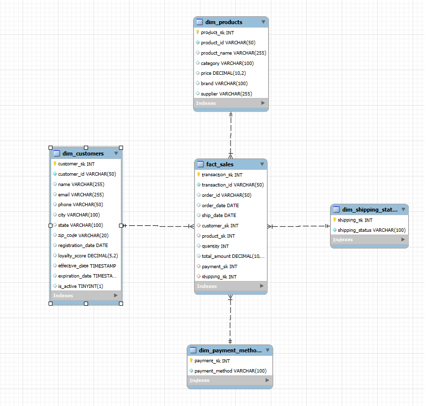
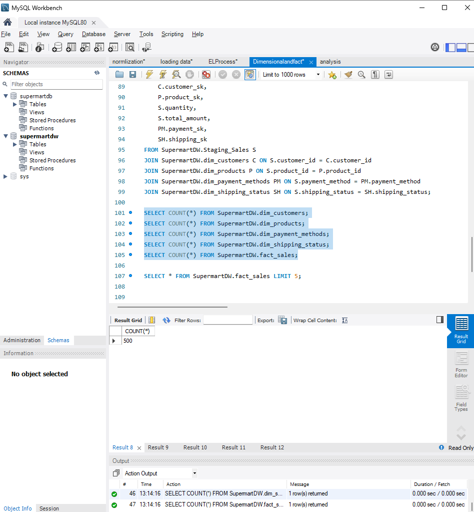
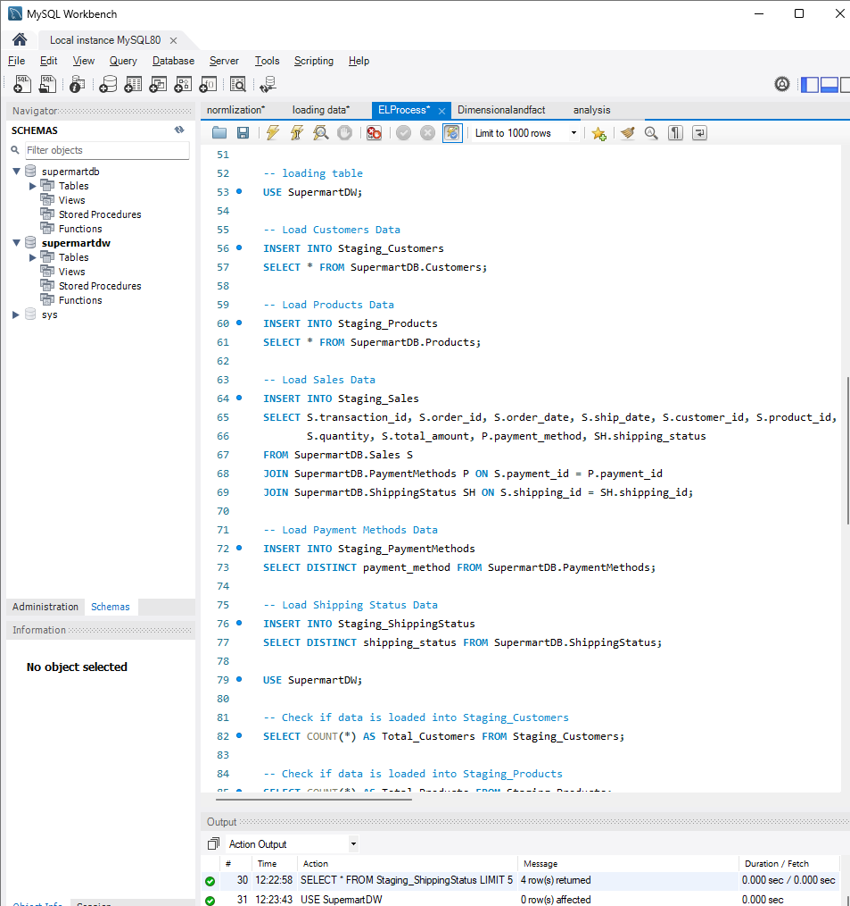
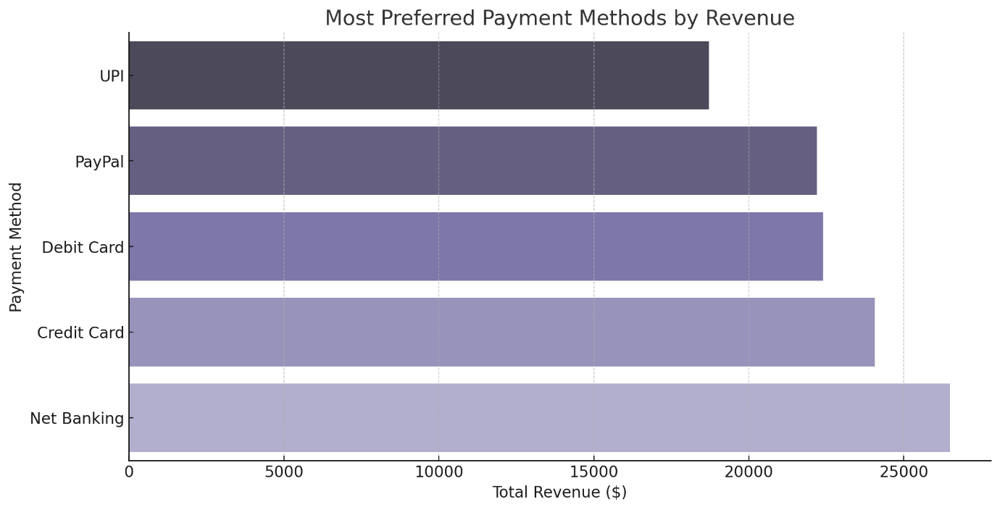
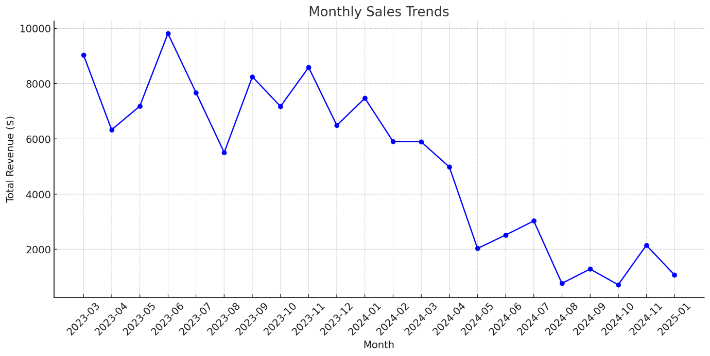
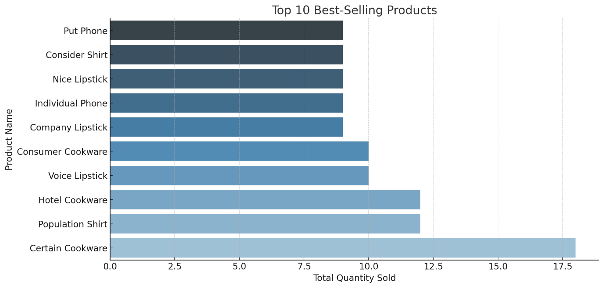
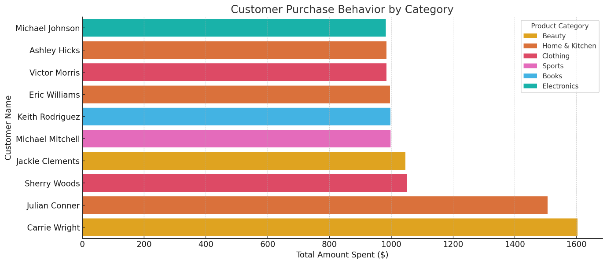

**[Target Data Warehouse Project -- Final Report]{.underline}**

**[1. Project Overview]{.underline}**

The Target Data Warehouse Project integrates e-commerce data into a
centralized data warehouse for business intelligence and analytics. The
project focuses on:\
Data Integration: Combining customer, product, and sales data.\
ETL Pipeline: Automating extraction, transformation, and loading (ETL).\
Business Insights: Analyzing trends, customer behaviour, and product
performance.

[Technologies Used]{.underline}

🔹 Database: MySQL (Star Schema)\
🔹 ETL Tools: MySQL LOAD DATA INFILE, Python\
🔹 Visualization: Excel\
🔹 Querying & Analysis: MySQL Workbench

**2. Project Structure**

The project follows a **structured folder organization**:

{width="6.273521434820648in"
height="2.9600251531058617in"}

{width="6.276887576552931in"
height="3.1539654418197727in"}

**2. Database Schema & ER Diagram**

The database follows a **Star Schema** for optimized analytics.

**Schema Overview**

-   **dim_customers** -- Customer details.

-   **dim_products** -- Product information.

-   **dim_payment_methods** -- Payment type reference.

-   **dim_shipping_status** -- Shipping status details.

-   **fact_sales** -- Sales transactions (linking all dimensions).

📌 **Screenshot: ER Diagram**

{width="6.276903980752406in"
height="3.9133180227471565in"}

**[Star Schema]{.underline}**

{width="6.304924540682415in"
height="4.580564304461943in"}

{width="6.268055555555556in"
height="4.625in"}**[3. ETL Process]{.underline}**

The **ETL Pipeline** is divided into four stages:

**1️ Extraction**

-   Raw data is loaded from CSV files into **staging tables** using LOAD
    DATA INFILE.

**2️ Transformation**

-   Data is cleaned and validated.

-   **Slowly Changing Dimensions (SCD Type 2)** is applied for tracking
    customer updates.

**3️ Loading**

-   Dimension and fact tables are populated with surrogate keys.

-   Referential integrity is ensured to maintain data consistency.

**4️ Data Validation**

-   Verification queries ensure no missing values or duplicate records.

{width="6.268055555555556in"
height="4.263888888888889in"}

**4. Key Analytical Queries & Business Insights**

**1️ Most Preferred Payment Methods**

**5. Business Insights & Visualization**

{width="6.268055555555556in"
height="3.198611111111111in"}

**[2️ Monthly Sales Trends]{.underline}**

{width="6.268055555555556in"
height="3.147222222222222in"}

**[3️ Top-Selling Products]{.underline}**

{width="6.268055555555556in"
height="3.002083333333333in"}

**[4. Customer Purchase Behaviour]{.underline}**

{width="6.2670395888014in"
height="2.3687937445319336in"}

**6. Future Enhancements**

🔹 **Real-time Data Processing:** Implement incremental ETL updates.\
🔹 **Advanced Analytics:** Introduce AI for demand forecasting.\
🔹 **Geographic Analysis:** Sales distribution by region.\
🔹 **Cloud Deployment:** Migrate to a cloud warehouse for scalability.

**7. Conclusion**

The **Target Data Warehouse Project** successfully consolidates data for
analytics, enabling **data-driven decision-making**. The insights
support **better customer engagement, sales forecasting, and marketing
strategies**.

**[Future Scope]{.underline}**

🔹 Implement **Machine Learning (ML) models** for **sales forecasting
and demand prediction**.\
🔹 Integrate **real-time ETL processing** to support **instant
decision-making**.\
🔹 Enhance **personalized marketing strategies** through **customer
segmentation and behavioural analytics**.\
🔹 Optimize **supply chain efficiency** by linking sales insights with
logistics and supplier data.

By leveraging the structured **dimensional model and analytical
insights**, the business can improve **customer engagement, sales
performance, and operational efficiency**, ensuring a **competitive
advantage in the e-commerce industry**.
